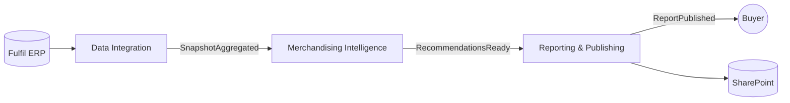

# Context Map

> **Status: DRAFT** — contexts & domain events ratified at Checkpoint B; owning agents & full
> roster ratified at Checkpoint C (2026-07-19). Rules & hooks still pending (Phases 4–5).

## Contexts
| Bounded Context | Subdomain type | Owning Agent | Aggregate Root(s) |
|-----------------|----------------|-------------------------|-------------------|
| Data Integration | supporting | data-integrator | DataSnapshot |
| Merchandising Intelligence | core | merchandising-analyst | ReorderPlan, AssortmentReview |
| Reporting & Publishing | supporting | report-publisher | Report |

## Relationships
> Direction reads "upstream → downstream". Pattern names come from the DDD glossary (Section F).

| Upstream | Downstream | Pattern | Notes |
|----------|-----------|---------|-------|
| Fulfil (external) | Data Integration | Anti-Corruption Layer | Data Integration translates Fulfil's model so its shape can't leak into our domain. |
| Data Integration | Merchandising Intelligence | Customer–Supplier (via events) | Merchandising computes everything from the DataSnapshot; the snapshot contract is a Published Language. |
| Merchandising Intelligence | Reporting & Publishing | Customer–Supplier (via events) | Reporting renders the recommendations; RecommendationsReady is the hand-off. |
| Reporting & Publishing | SharePoint (external) | Conformist | We publish into SharePoint's existing structure. |

## Domain Events (hand-offs routed by the Product Owner)
| Event | Emitted by | Routed to | Trigger |
|-------|-----------|-----------|---------|
| SnapshotAggregated | data-integrator | merchandising-analyst | A fresh, clean DataSnapshot is ready to analyze |
| RecommendationsReady | merchandising-analyst | report-publisher | Reorder / slow-mover / overstock guidance has been computed |
| ReportPublished | report-publisher | (Buyer / Product Owner) | A Report was saved to SharePoint |

## Diagram

